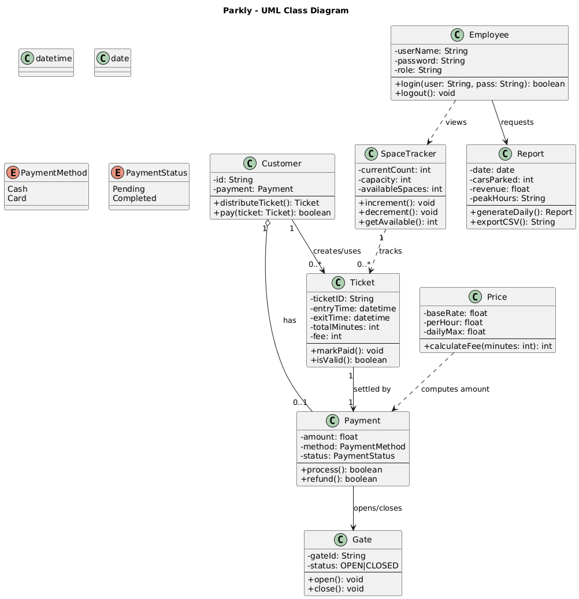
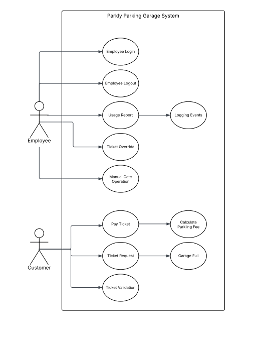
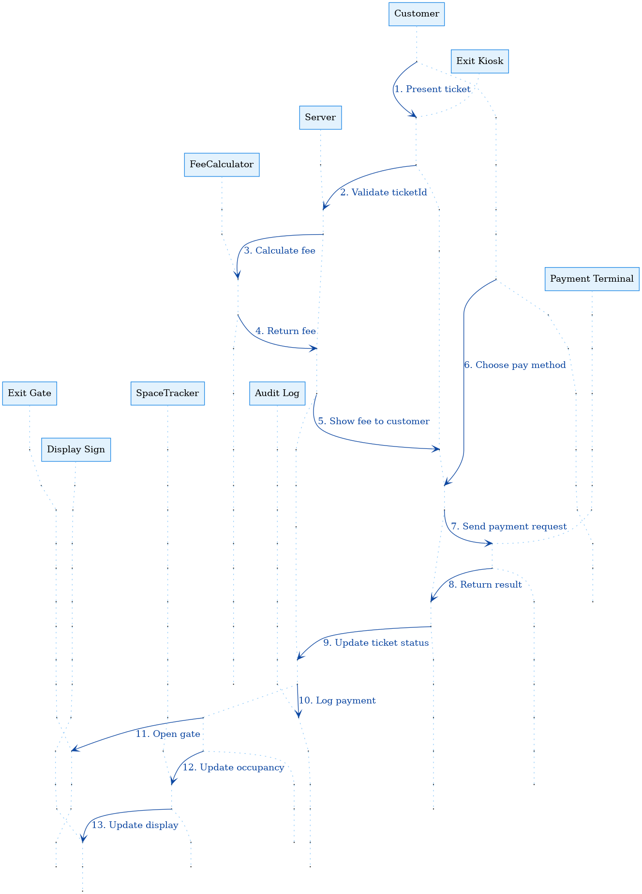

<div align="center">
  

  # 🅿️ Parkly: Comprehensive Garage Operations System

  **Multi-threaded, concurrent Java parking garage management system** — automated ticketing, secure payments, real-time space tracking, and employee operations, built around socket-based client/server architecture and classic OOP design patterns.

  
  
  
  
</div>

---

## Key Functionalities

- **Ticketing & Tracking** — Automated generation of unique ticket IDs, complete ticket tracking, and space tracking to manage occupancy in real time.
- **Access Control** — Manages entry to the garage via ticket generation and exit gate operation based on validated payment or authorized user override.
- **Financial & Security** — Tracks payment status per ticket and provides secure employee login validation coupled with employee time tracking.

## Architectural Highlights

Parkly is built using key object-oriented design patterns to ensure stability and efficiency:

- **Multiple Threaded Server Sockets** — Enables the system to handle concurrent client requests (multiple entry/exit gates, employee terminals) simultaneously without blocking, ensuring high performance and responsiveness.
- **Singleton Pattern** — Used for critical, centralized components (like the Ticket ID Generator or the Space Inventory Manager) to ensure a single, authoritative instance and prevent concurrency issues like duplicated IDs or incorrect space assignments.
- **Facade Design Pattern** — Provides a simplified, unified interface to complex operational sub-systems (e.g., calling one method to process an exit handles payment validation, time tracking updates, and ticket reconciliation internally).

Overall, Parkly showcases skills in concurrency, security implementation, and sophisticated systems architecture.

---

## System Design

### Class diagram

A full UML class diagram of the domain model — Customer, Employee, Ticket, Payment, Gate, SpaceTracker, Report, Price, with explicit relationships and multiplicities:



### Use case diagram

Actors (Customer + Employee) and the operations Parkly supports — login/logout, usage reports, ticket override, manual gate operation, pay ticket, ticket request/validation, fee calculation, garage-full handling, and event logging:



### Sequence diagram — Customer exit flow

The 13-step interaction sequence between Customer → Exit Kiosk → Server → FeeCalculator → Payment Terminal → Exit Gate → SpaceTracker → Audit Log → Display Sign for processing a customer exit:



---

## Project structure

```
Parkly/
├── src/parkly/          → Java source (24 files): server, GUIs, services, domain
├── images/              → Logo + UI image assets
├── docs/                → UML diagrams (class, sequence, use case)
├── bin/                 → Compiled output (ignored in source control)
├── Parkly SRS.docx                       → Software Requirements Specification
├── Parkly Use Case Specification.docx    → Detailed use case writeups
├── Parkly UML Use Case Diagrams.docx     → Source for use case PNG
├── Parkly Sequence Diagram.docx          → Source for sequence PNG
├── UML Class Diagrams.docx               → Source for class PNG
└── README.md
```

The Java source under `src/parkly/` is organized into:

- **Domain** — `Customer`, `Employee`, `Ticket`, `Payment`, `Gate`, `Price`, `Report`, `SpaceTracker`, enums (`PaymentMethod`, `PaymentStatus`)
- **Networking** — `Server`, `ServerHandler`, `SocketConnection`, `SocketConnectionService`, `EmployeeSocket`, `Message`, `ObjectTag`
- **Services (Facade layer)** — `AuthenticationService`, `PaymentService`, `TicketService`, `LocalPayment`
- **GUI (Swing)** — `LoginGUI`, `EmployeeGUI`, `FeeGUI`, `OpenGateGUI`

---

## Build & run

### Prerequisites

- JDK 11+
- Eclipse (project is Eclipse-configured) or any Java IDE that imports the `src/` layout

### Compile from the command line

```bash
javac -d bin $(find src -name "*.java")
```

### Run the server

```bash
java -cp bin parkly.Server
```

### Run a client (employee terminal or kiosk)

```bash
java -cp bin parkly.LoginGUI
```

---

## Design documentation

Full design artifacts are versioned in the repo as Word documents:

- 📘 **`Parkly SRS.docx`** — Software Requirements Specification
- 📘 **`Parkly Use Case Specification.docx`** — Detailed per-use-case writeups
- 📘 **`Parkly UML Use Case Diagrams.docx`** — Use case diagram source
- 📘 **`Parkly Sequence Diagram.docx`** — Sequence diagram source
- 📘 **`UML Class Diagrams.docx`** — Class diagram source

The diagrams embedded above in the README are extracted from these Word documents and re-saved as PNGs in `docs/` for GitHub rendering.

---

## Team

Built as the CS 401 Software Engineering capstone project at California State University, East Bay. See the [Contributors](https://github.com/jfrias-CS/Parkly/graphs/contributors) for the full team credits.

## License

See the repository for license details.
